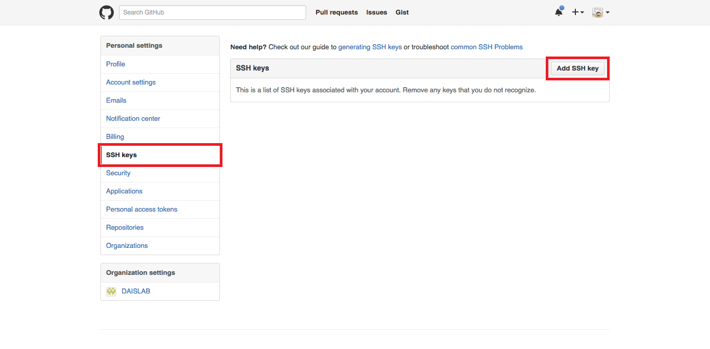
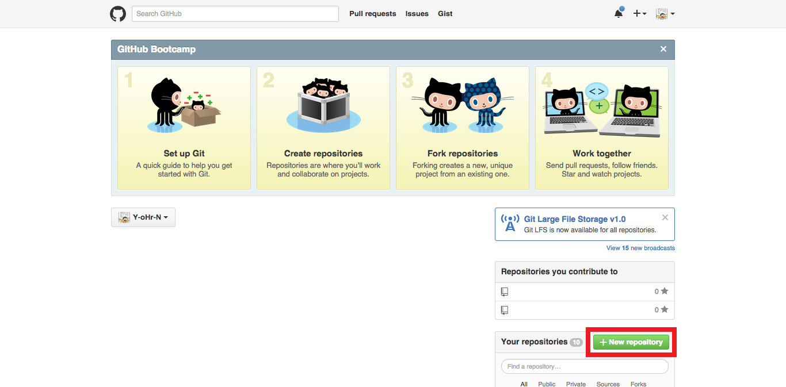
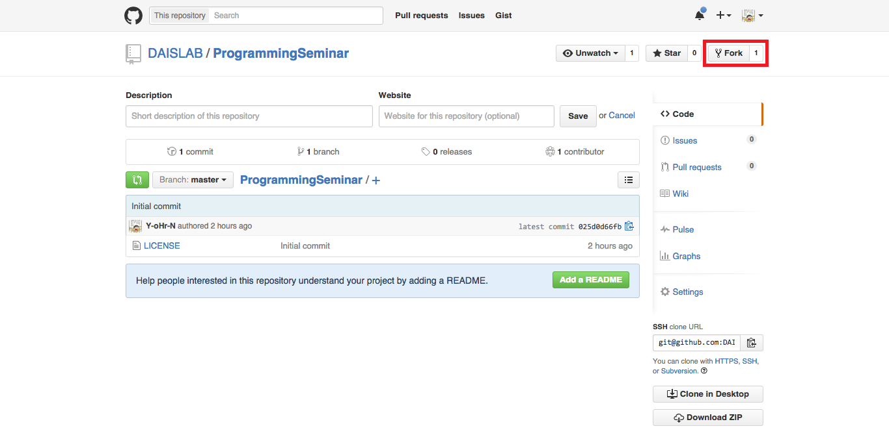
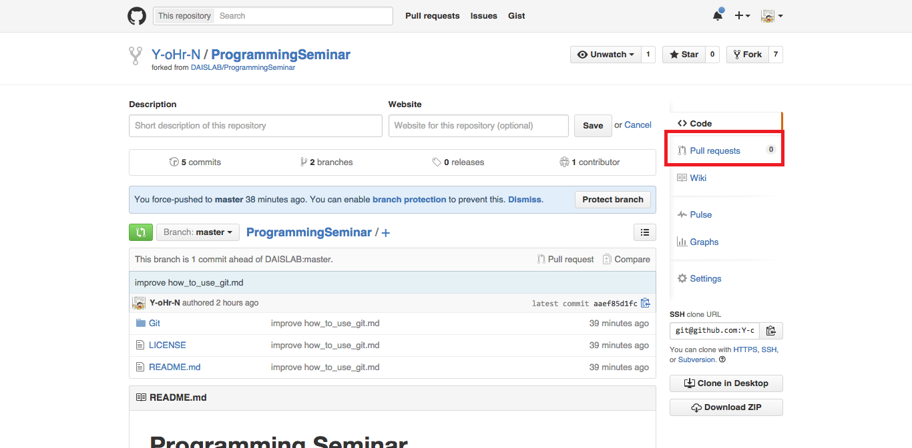

# Git/Github の使用方法

Author: Yu Ohori

Date: Oct/9/2015

OS: OS X

## 用語の説明
remote repository

local repository

index

working tree

add

commit

push

pull

branch

merge

fork

clone

origin

upstream

## ローカルのみで使用する場合

### 初期設定

user.name を設定

`$ git config --global user.name <username>`

user.email を設定

`$ git config --global user.email <mailaddress>`

###  SSH 接続設定

ルートディレクトリへ移動

`$ cd ~`

.ssh ディレクトリを作成

`$ mkdir .ssh`

.ssh ディレクトリへ移動

`$ cd .ssh`

秘密鍵 ( id\_rsa )と公開鍵 ( id\_rsa.pub ) のペアを生成

`$ ssh-keygen -t rsa -C "<comment>"`

* -t: 鍵タイプを指定
* -C: 鍵のコメントを新規作成

生成の際に以下の 3 つの入力を求められるが全て Enter で OK

* 鍵の保存先
* パスフレーズ
* パスフレーズ ( 2 回目 )

クリップボードに公開鍵の内容をコピー

`$ pbcopy < ./id_rsa.pub`

Github の Setting で公開鍵の内容を登録

### 基本手順
空ディレクトリ ( 作業ディレクトリ ) を生成

`$ mkdir <dirname>`

作成したディレクトリへ移動

`$ cd <dirname>`

ローカルリポジトリを作成

`$ git init`

空ファイルを生成

`$ touch <filename>`

テキストエディタなどでファイルを編集

ディレクトリまたはファイルをステージング

`$ git add <filepattern>`

ディレクトリまたはファイルをコミット

`$ git commit -m "<comment>"`

### コミットに関する操作

コミットの履歴を表示

`$ git log`

直前のコミットを修正

`$ git commit --amend -m "<newcomment>"`

直前のコミットを取消

`$ git reset --soft/mixed/hard HEAD^`

* --soft: HEAD の位置に影響
* --mixed: HEAD の位置, インデックスに影響
* --hard: HEAD の位置, インデックス, ワーキングツリーに影響

n 個前のコミットを取消

`$ git reset --soft/mixed/hard HEAD~n`

### ブランチに関する操作

ブランチを作成

`$ git branch <branchname>`

ブランチを作成かつ切替

`$ git checkout -b <branchname>`

ブランチの一覧を表示

`$ git branch`

ブランチの名前を変更

`$ git branch -m <oldbranchname> <newbranchname>`

ブランチを切替

`$ git checkout <branchname>`

他のブランチをマージ

`$ git merge <branchname>`

## 個人のリモートリポジトリを使用する場合

リモートリポジトリを作成

リモートリポジトリの URL をクリップボードにコピー

リモートリポジトリを追加

`$ git remote add <reponame> <url>`

リモートリポジトリの一覧を表示

`$ git remote`

リモートリポジトリにブランチの変更内容を反映

`$ git push -u <reponame> <branchname>`

* -u: このオプションをつけると以降は `$ git push` のみでプッシュ可能

## 組織のリモートリポジトリを使用する場合

目的のリポジトリ ( 以下，オリジナルリポジトリ ) をフォーク

フォークしてきたリポジトリ ( 以下，ユーザリポジトリ ) をクローン

`$ git clone <url>`

作業ディレクトリへ移動

`$ cd <dirname>`

ユーザリポジトリを追加

`$ git remote add origin <url>`

オリジナルリポジトリ を追加

`$ git remote add upstream <url>`

オリジナルリポジトリの更新に追随

`$ git pull upstream master`

ユーザリポジトリにブランチの変更内容を反映

`$ git push origin develop`

プルリクエストを作成

## 参考文献

* [サルでもわかる Git 入門](http://www.backlog.jp/git-guide/)
* [SSH の公開鍵を作成し Github に登録する手順](http://monsat.hatenablog.com/entry/generating-ssh-keys-for-github)
* [GitHub へ pull request する際のベストプラクティス](http://d.hatena.ne.jp/hnw/20110528)
